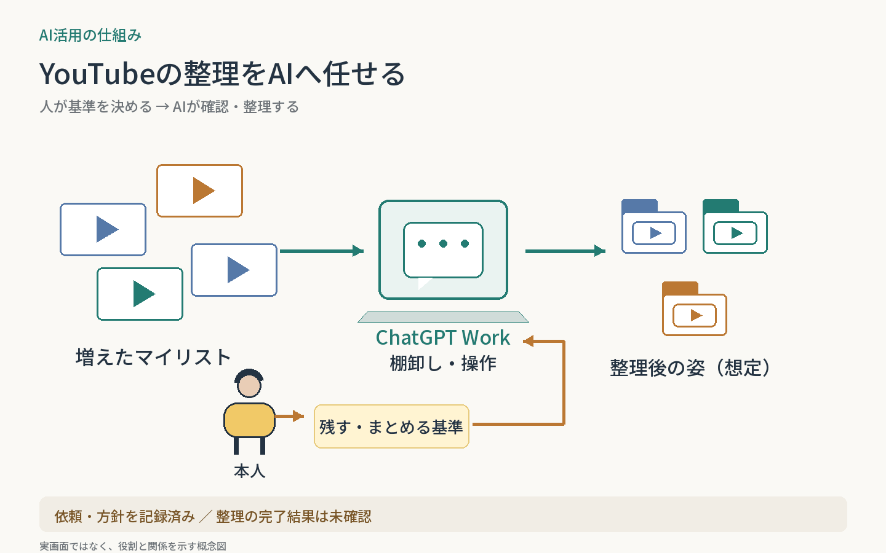
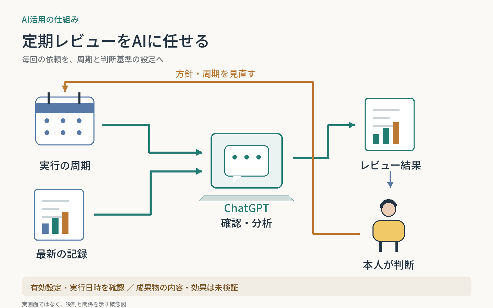

# AI Use Cases

ChatGPT・Claude.aiのチャット／Work／スケジュールで、AIへ任せる作業と人間の判断を設計した事例集。図から概要をつかみ、気になるケースへ進めます。

| GUI作業の委譲 | 定期レビューの自動化 |
| --- | --- |
| [](cases/youtube-playlist-cleanup/) | [](cases/scheduled-reviews/) |
| **[YouTubeマイリスト整理](cases/youtube-playlist-cleanup/)** | **[スケジュールによる定期レビュー](cases/scheduled-reviews/)** |
| AIが棚卸し・分類・操作を担当。人間が整理方針を決める。 | AIが定期的に情報を確認・分析。人間が方針と次の行動を決める。 |
| 記録済み：作業依頼と方針／完了結果は未確認 | 設定・実行履歴を確認／成果物と効果は未検証 |

図は仕組みの概念図です。実画面や実績の証拠ではありません。

Claude Code製の独立アプリ・プロジェクトは、各リポジトリとポートフォリオで紹介します。

<details>
<summary>AIでケースを追加・更新する方へ（最初に読む）</summary>

**最初に最新mainの [AGENTS.md](AGENTS.md) を全文読み、指定された読み取り順に従ってください。** 操作方法やチャットが変わっても、このファイルが方針の正本です。

別チャットでは次の開始文を使えます。

```text
GitHubの n-yoshida-dev/ai-use-cases を対象に、今回のAI活用事例を記録してください。
最初に最新mainのAGENTS.mdを全文読み、そこに指定された順でREADME・記録プロンプト・テンプレート・関連ケースを読んでください。
登録対象・日本語の概念図・公開ルールを守り、同じ事例があれば更新してください。
参照できない会話や未確認の成果を補わないでください。
```

[記録プロンプト](prompts/capture-case.md) ／ [図の仕様](templates/cover-brief.md)

指示ファイルは別チャットへ自動配信されません。依頼時にリポジトリと読み取り指定を渡してください。

</details>
