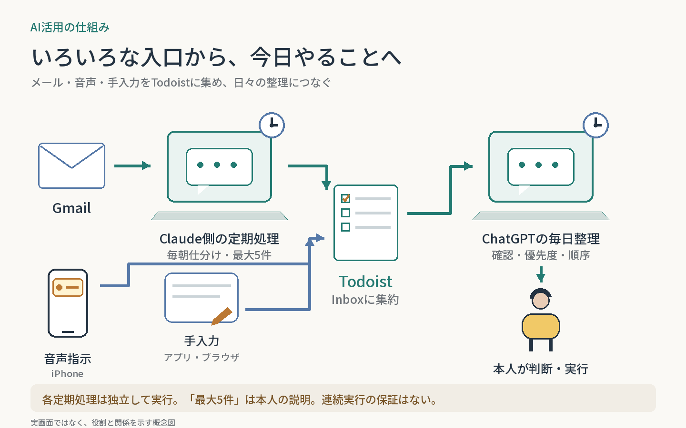
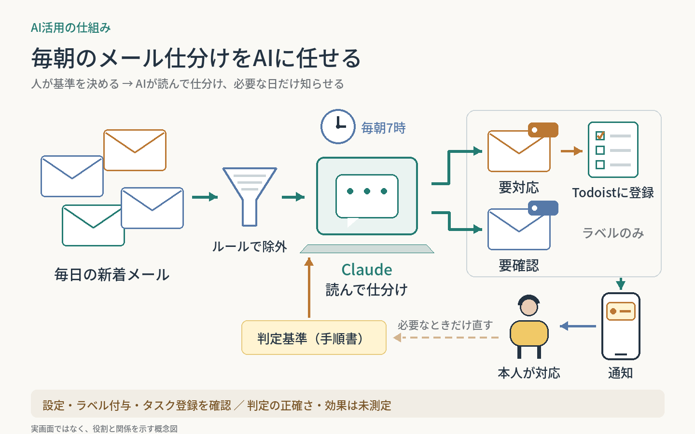

# AI Use Cases

ChatGPT・Claude.aiのチャット／Work／スケジュール（Claude Codeのルーティンを含む）で、AIへ任せる作業と人間の判断を設計した事例集。図から概要をつかみ、気になるケースへ進めます。

## 仕組み全体

| 日々のタスク管理 | 文脈と読書の循環 |
| --- | --- |
| [](systems/daily-task-hub/) | [](systems/context-reading-loop/) |
| **[メール・音声・手入力から実行へ](systems/daily-task-hub/)** | **[会話の文脈から次に読む本へ](systems/context-reading-loop/)** |

[全体構成の一覧](systems/README.md)

## 個別ケース

| GUI作業の委譲 | 定期レビューの自動化 | 毎朝のメール仕分け |
| --- | --- | --- |
| [](cases/youtube-playlist-cleanup/) | [](cases/scheduled-reviews/) | [](cases/daily-email-triage/) |
| **[YouTubeマイリスト整理](cases/youtube-playlist-cleanup/)** | **[スケジュールによる定期レビュー](cases/scheduled-reviews/)** | **[毎朝のメール仕分け](cases/daily-email-triage/)** |
| AIが棚卸し・分類・操作を担当。人間が整理方針を決める。 | AIが定期的に情報を確認・分析。人間が方針と次の行動を決める。 | AIが毎朝読んで仕分け・通知。人間が判定基準を決め、対応する。 |
| 記録済み：作業依頼と方針／完了結果は未確認 | 設定・実行履歴を確認／成果物と効果は未検証 | 設定・出力を確認／判定の正確さと効果は未測定 |

| 毎朝のタスク整理 |
| --- |
| [](cases/daily-todoist-triage/) |
| **[毎朝のTodoist整理](cases/daily-todoist-triage/)** |
| AIがInboxの分類・期限・順序を整理。人間が優先度と除外範囲を決める。 |
| 初回整理・設定を確認／翌朝の自動実行とテスト結果は未確認 |

図は仕組みの概念図です。実画面や実績の証拠ではありません。

Claude Code製の独立アプリ・プロジェクトは、各リポジトリとポートフォリオで紹介します。

<details>
<summary>AIでケースを追加・更新する方へ（最初に読む）</summary>

**最初に最新mainの [AGENTS.md](AGENTS.md) を全文読み、指定された読み取り順に従ってください。** 操作方法やチャットが変わっても、このファイルが方針の正本です。

別チャットでは次の開始文を使えます。

```text
GitHubの n-yoshida-dev/ai-use-cases を対象に、今回のAI活用事例を記録してください。
最初に最新mainのAGENTS.mdを全文読み、そこに指定された順でREADME・記録プロンプト・テンプレート・関連ケースを読んでください。
登録対象・日本語の概念図・公開ルールを守り、同じ事例があれば更新してください。
参照できない会話や未確認の成果を補わないでください。
```

[記録プロンプト](prompts/capture-case.md) ／ [図の仕様](templates/cover-brief.md)

指示ファイルは別チャットへ自動配信されません。依頼時にリポジトリと読み取り指定を渡してください。

</details>
