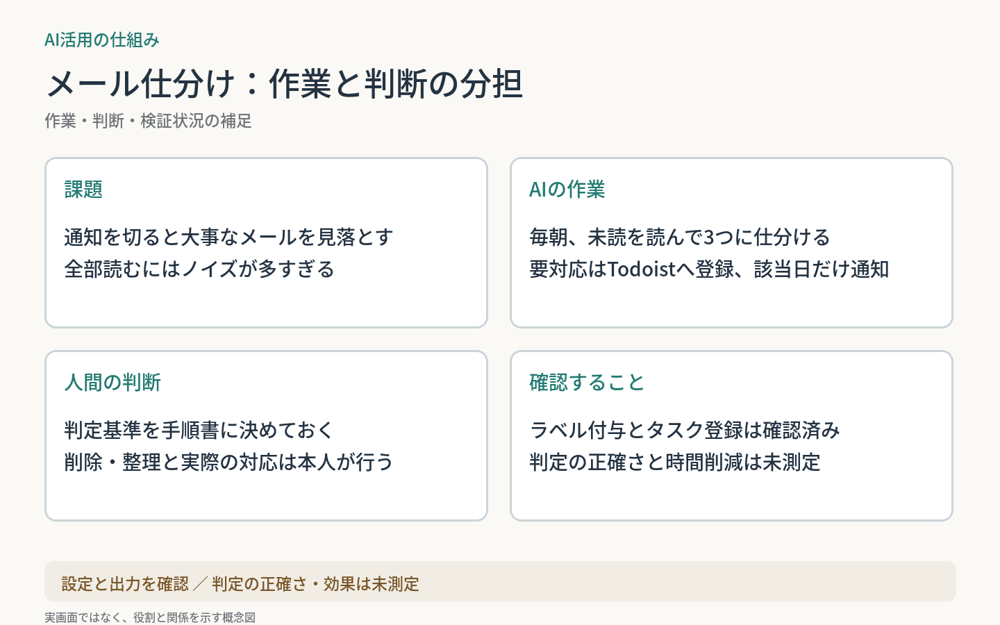

# 毎朝のメール仕分けをAIへ委譲

通知を切ると大事なメールを見落とし、全部読むにはノイズが多い。この確認作業を、Claude Codeのルーティン（クラウドの定期実行）へ委譲する事例。
先にGmailのフィルタで明らかなノイズを外し、残りをAIが毎朝読んで「要対応／要確認／不要」に分ける。
**設定と、ラベル付与・タスク登録までの出力を確認。判定の正確さと効果は未測定。**

| 従来 | 運用の形 |
| --- | --- |
| 受信箱を自分で見て拾う | AIが仕分け、要対応はTodoistのタスクに。該当がある日だけスマホへ通知 |

**AI：** 未読メールの判定、ラベル付け、タスク登録、通知。削除・アーカイブ・返信はしない。  
**人間：** 判定基準の決定（修正は必要なときだけ）、メールの整理、実際の対応。

2026年8月から稼働。要対応ラベル22件、タスク登録の送信20通を確認した（2026-10-06）。

再利用できる工夫：

- 判定基準は手順書1か所に置く。直せば翌朝から反映される。
- 迷ったら「要確認」に倒す。
- タスク登録は「追加しかできない」経路に絞る。
- 0件の日は通知しない。週1回だけ生存確認を送り、停止に気づけるようにする。

作業と判断の説明図を見る

[一覧へ戻る](../../README.md)
