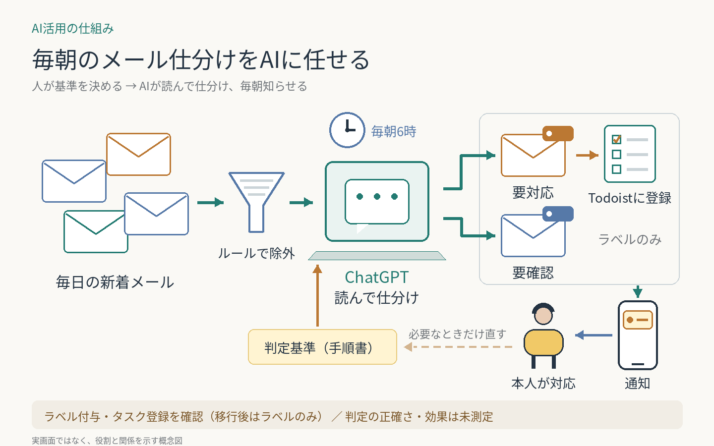
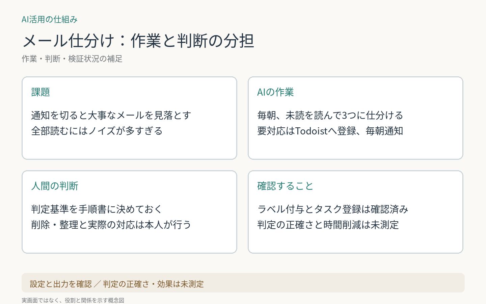

# 毎朝のメール仕分けをAIへ委譲

通知を切ると大事なメールを見落とし、全部読むにはノイズが多い。この確認作業をAIの定期実行へ委譲する事例。
先にGmailのフィルタで明らかなノイズを外し、残りをAIが毎朝読んで「要対応／要確認／不要」に分ける。
2026年8月にClaude Codeのルーティンで始め、10月28日にChatGPTの毎朝のTodoist整理の前段へ移した。
**設定と、ラベル付与・タスク登録までの出力を確認。判定の正確さと効果は未測定。**

| 従来 | 運用の形 |
| --- | --- |
| 受信箱を自分で見て拾う | AIが仕分け、要対応はTodoistのタスクに。毎朝スマホへ通知（0件の日も） |

**AI：** 未読メールの判定、ラベル付け、タスク登録、通知。削除・アーカイブ・返信はしない。  
**人間：** 判定基準の決定（修正は必要なときだけ）、メールの整理、実際の対応。

要対応ラベル30件・タスク登録の送信27通を確認（移行前、2026-10-23）。移行後もラベル付与を確認（2026-10-29）。

再利用できる工夫：

- 判定基準は手順書1か所に置く。実行するAIを替えても、基準はそのまま使えた。
- 仕分けをタスク整理の前に置く。メール由来のタスクがその日の優先順位に入る。
- メールの期限は予定日でなくタスク名に書く。整理側が未来の予定と見て後回しにしないため。
- 迷ったら「要確認」に倒す。
- 0件の日も毎朝通知を送る。通知が来なければ、止まったと気づける。

作業と判断の説明図を見る

[タスク管理の全体像](../../systems/daily-task-hub/) ／ [毎朝のTodoist整理](../daily-todoist-triage/)

[一覧へ戻る](../../README.md)
