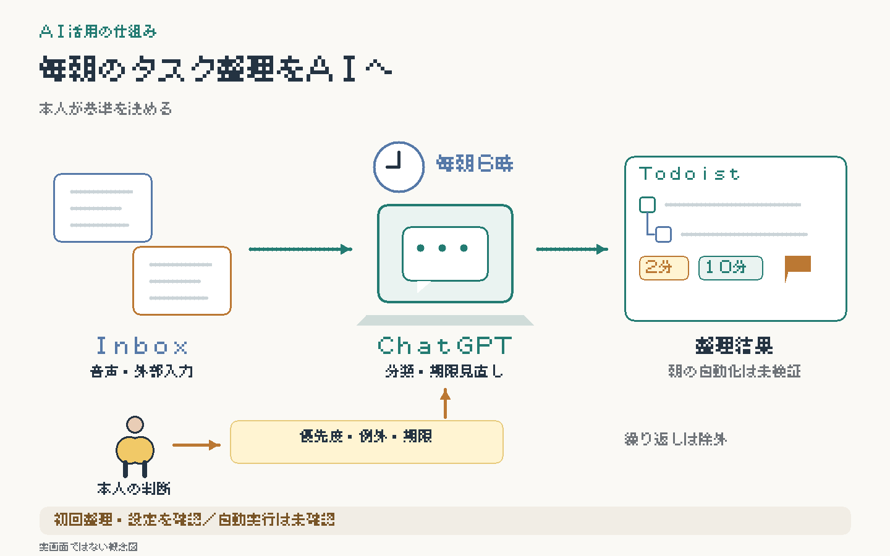

# 毎朝のTodoist整理をAIへ委譲

音声入力や外部ツールから積み重なるタスクを、ChatGPT Workで整理し、毎朝6時（日本時間）のスケジュールへ引き継ぐ事例。
**初回の整理操作と設定を確認。翌朝の自動実行とテスト結果は未確認。**

**AI：** Inboxの分類、サブタスク化、時間・委譲先のタグ付け、期限の見直し、今日の順序の整理。  
**人間：** 優先度・除外範囲の決定、例外判断、本人が担う作業の実行。

初回は既存98件を保持して整理。時間・委譲先など9種類のラベルを作り、架空のテスト7件も登録した。本人が整理結果を確認し、優先度の基準を修正した。

再利用できる工夫：

- P1は重要かつ緊急、P2は重要だが緊急ではない。通常はP4、P3は使わない。
- 確定期限・元からある日付・AIの変更可能な予定を区別。不明な日付は保護する。
- 繰り返しプロジェクトは取得・変更・報告から除外。他プロジェクトの期限確認は読み取りだけ。
- 変更前後を照合し、関係・期限の保持と重複を確認する。日曜は大きな目標の次の一手も見直す。

削減時間・継続運用の効果は未測定。

[タスク管理の全体像](../../systems/daily-task-hub/)

[一覧へ戻る](../../README.md)
