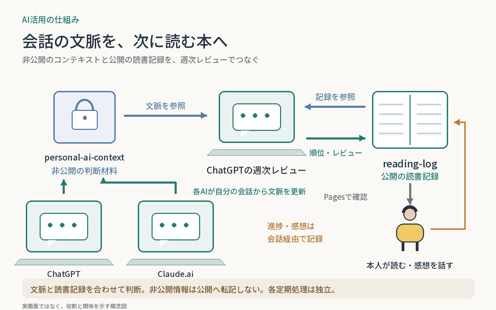

# 会話の文脈を、次に読む本へつなぐ

ChatGPTとClaude.aiが、それぞれの会話から長期的に必要な差分をpersonal-ai-contextへ整理する。読書レビューは、この文脈・参照できる最近の会話・reading-logの読書記録を合わせて、次に読む本を判断する。

| 正本・処理 | 担うこと |
| --- | --- |
| personal-ai-context（非公開） | 目標・判断基準・継続的な制約。各AIが自サービスの差分を更新し、最新mainを共有 |
| reading-log（公開） | 本、進捗、本人の感想、読後アクション、読む順位、週次レビュー |
| ChatGPTの週次読書レビュー | 両方の正本と取得できた会話を参照。reading_order・レビューをreading-logへ反映 |
| GitHub Pages・本人 | 本棚と「次に読む」を見て読む。進捗・感想を会話経由で再びreading-logへ記録 |

**読書レビューからpersonal-ai-contextへは書き戻さない。** 非公開情報は判断材料にとどめ、公開の順位理由は必要な範囲へ一般化する。会話全文は公開しない。

定例更新のルールはChatGPT→Claude.aiの順で時間をずらし、どちらも書き込み直前に最新mainを確認する。読書レビューは実行時に取得できる最新状態を使い、同じ週のコンテキスト更新完了を待つイベント連鎖ではない。

連携仕様とChatGPT側の有効設定を確認。Claude側の現行設定、毎回の保存成功、推薦の効果は今回検証していない。

関連する個別ケース：[定期レビュー](../../cases/scheduled-reviews/)  
外部の正本：[reading-log](https://github.com/n-yoshida-dev/reading-log) ／ [personal-ai-context（非公開）](https://github.com/n-yoshida-dev/personal-ai-context)

[全体構成一覧](../README.md) ／ [トップ](../../README.md)
